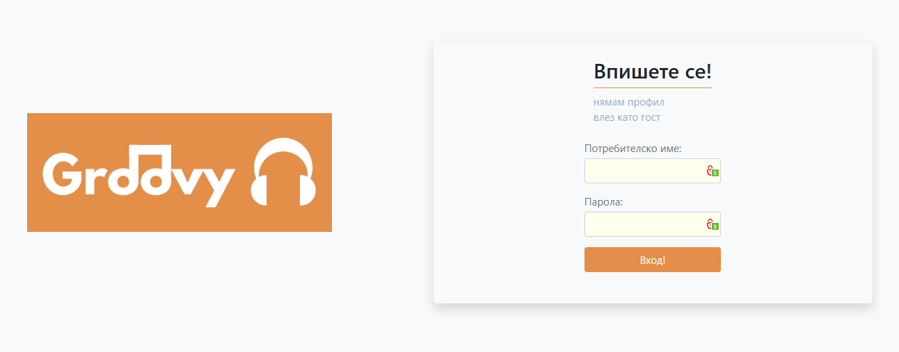
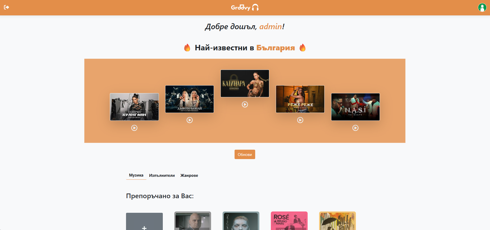
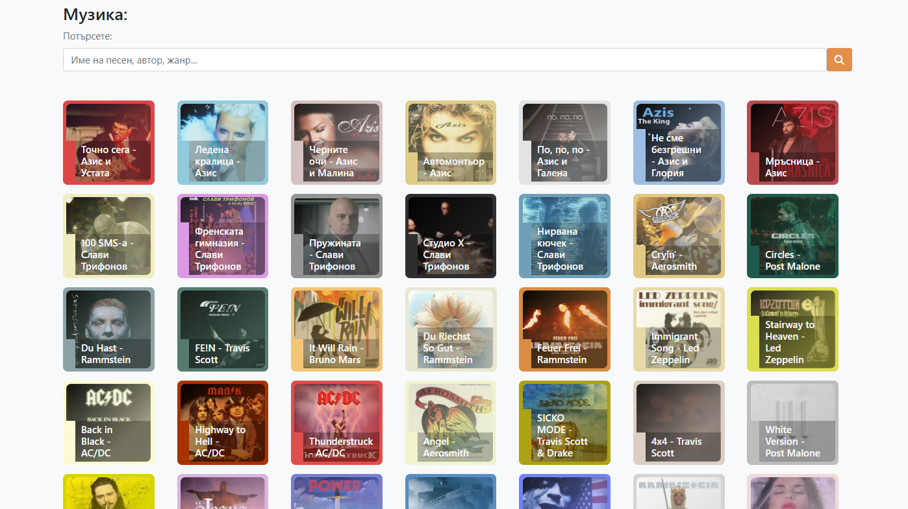
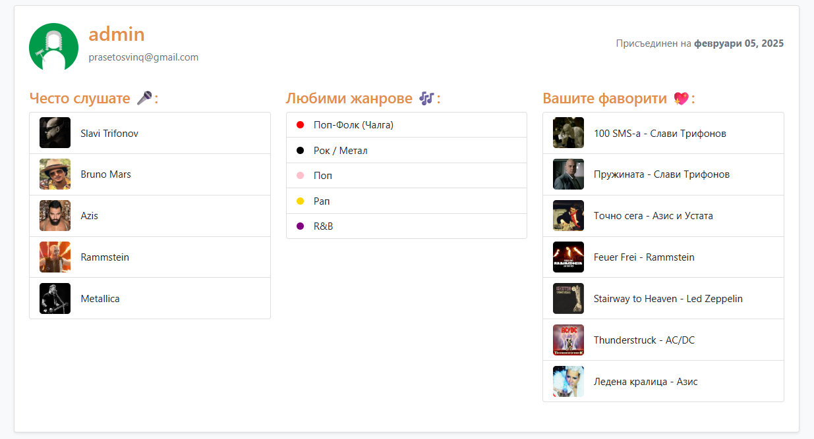

# Groovy 🎧 
> *"Music washes away from the soul the dust of everyday life."*  
> — **Berthold Auerbach**  

*A modern audio-sharing platform inspired by SoundCloud, built with ASP.NET Core MVC.*  

  

---

## 📌 Features
- 🎵 Upload, manage, and stream audio files  
- 👥 User authentication & profiles  
- 💖 Favourites system 
- 🔍 Search & explore trending tracks
- 📊 Automatic recommendation algorithm
- 📈 List of top 5 *currently* trending songs in Bulgaria

---

## 🚀 Video Demo


---

## 🛠️ Tech Stack
- **Backend:** ASP.NET Core MVC, C#  
- **Frontend:** Razor Views, Bootstrap  
- **Database:** Free MySQL Server  
- **File Storage:** In the API

---

## 📸 Screenshots

| Login | Homepage | Songs Page | User Profile |  
|-------|----------|------------|--------------| 
|  |  |  |  |

---

## 📝 Installation & Setup
### 🔧 Prerequisites
- [.NET 7+ SDK](https://dotnet.microsoft.com/download/dotnet)  
- [Groovy API running locally](https://github.com/DesislavPavlov/GroovyApi) 

### 💻 Local Setup
1️⃣ **Clone the repository**  
```sh
git clone https://github.com/yourusername/groovy.git
cd groovy
```
2️⃣ **Ensure the API is running**  
- Groovy fetches data from an external ASP.NET Core API.
- By default, the frontend expects the API to be available at:
```csharp
https://localhost:7021/api
```
> You can change this in *Services/APIService.cs* by modifying:
```csharp
private readonly string _apiBaseUrl = "https://localhost:7021/api";
```

3️⃣ **Run the application**  
```sh
dotnet restore
dotnet run
```

Visit **`http://localhost:5000`** in your browser.

---

## 📩 Contact
💡 **Developers:** Desislav Pavlov, Ivan Momchilov  
📧 **Email:** makotashako@gmail.com, vankomomchilov@gmail.com  
🐙 **GitHub:** [DesislavPavlov](https://github.com/DesislavPavlov), [IvanMomchilov123](https://github.com/IvanMomchilov123)  
🔗 **LinkedIn:** [Desislav Pavlov](https://www.linkedin.com/in/developer-d-pavlov/), [Ivan Momchilov](https://www.linkedin.com/in/ivan-momchilov-059a0236a/)  

---

### 💡 Notes for Employers
- This project is a **fully functional prototype** of an audio platform.  
- If you’d like a walkthrough, check out the **screenshots and video demo** above!  
